# 프랜차이즈 경쟁 압력이 독립 브랜드의 평점과 소비자 언어에 미치는 영향
## — 거리 가중 경쟁압력 지수(FPI)를 활용한 공간·텍스트 통합 분석

**마케팅조사 4조 | 최종 보고서**  
**분석 지역**: Las Vegas, NV (USA)  
**분석 데이터**: Yelp Open Dataset (yelp_business.csv · yelp_review.csv)  
**작성일**: 2026년 6월

---

# 목차

1. [Executive Summary](#1-executive-summary)
2. [프로젝트 개요](#2-프로젝트-개요)
3. [데이터 소개](#3-데이터-소개)
4. [분석 설계 및 방법론](#4-분석-설계-및-방법론)
5. [데이터 전처리 및 탐색적 분석 (EDA)](#5-데이터-전처리-및-탐색적-분석-eda)
6. [분석 1: 자체 감성 사전 구축 (TF-IDF 기반)](#6-분석-1-자체-감성-사전-구축-tf-idf-기반)
7. [분석 2: FPI 산출 및 임계거리 도출](#7-분석-2-fpi-산출-및-임계거리-도출)
8. [분석 3: 회귀분석 — FPI가 별점에 미치는 영향 (PART 1)](#8-분석-3-회귀분석--fpi가-별점에-미치는-영향-part-1)
9. [분석 4: 텍스트 분석 — FPI 구간별 소비자 언어 (PART 1)](#9-분석-4-텍스트-분석--fpi-구간별-소비자-언어-part-1)
10. [분석 5: 패스트푸드 업종 심화 분석 도입 (PART 2)](#10-분석-5-패스트푸드-업종-심화-분석-도입-part-2)
11. [분석 6: 회귀분석 심화 — FPI·별점·폐업 관계 (PART 2)](#11-분석-6-회귀분석-심화--fpi별점폐업-관계-part-2)
12. [분석 7: 심화 텍스트 분석 — 생존 전략 규명 (PART 2)](#12-분석-7-심화-텍스트-분석--생존-전략-규명-part-2)
13. [분석 8: FPI 공간 분포 지도 시각화](#13-분석-8-fpi-공간-분포-지도-시각화)
14. [연구 질문 종합 답변](#14-연구-질문-종합-답변)
15. [핵심 비즈니스 인사이트](#15-핵심-비즈니스-인사이트)
16. [계획 대비 수행 결과](#16-계획-대비-수행-결과)
17. [프로젝트 한계](#17-프로젝트-한계)
18. [향후 연구 방향](#18-향후-연구-방향)
19. [결론](#19-결론)

---

# 1. Executive Summary

본 연구는 Yelp 공개 데이터셋을 활용해 Las Vegas 지역 독립 레스토랑이 주변 프랜차이즈로부터 받는 경쟁 압력을 정량화하고, 이것이 소비자 평가와 브랜드 생존에 미치는 영향을 규명한다.

**핵심 기여**: 거리·품질·감성을 통합한 자체 지수인 Franchise Pressure Index(FPI)를 설계하고, 이를 공간 분석, 통계 검증, 텍스트 마이닝과 결합하여 **현상 기술을 넘어 생존 전략을 처방**하는 것을 목표로 한다.

**주요 발견**:

| 항목 | PART 1 (전체 Restaurants) | PART 2 (패스트푸드·버거) |
|---|---|---|
| 분석 데이터 | 5,899개 업체 / 929,606개 리뷰 | 1,579개 업체 / 178,094개 리뷰 |
| FPI → 별점 효과 | β = −0.012, p = 0.033 | **β = −0.027, p = 0.048 (2.3배)** |
| 임계거리 | 300m | 300m |
| FPI → 폐업 직접 효과 | 미분석 | p = 0.401 (비유의) |
| 폐업 핵심 변수 | — | 리뷰수 (OR = 1.621) |
| 감성 사전 검증 (VADER r) | 0.724 | **0.792** |

**생존 브랜드의 언어적 특성**: 동일 고압력(HP) 상권 안에서도 생존 브랜드(stars ≥ 4.0)는 고전 브랜드(stars ≤ 3.0) 대비 VADER 감성 강도가 62% 높고(0.738 vs 0.454), 'homemade'·'house made'·'family owned' 등 수제·오너십 표현을 3~10배 더 많이 사용한다.

**입지보다 전략**: FPI 지도에서 Strip 상권 내 생존·고전 브랜드가 혼재하는 패턴이 확인되었다. 위치 자체가 운명을 결정하지 않으며, **차별화 메뉴와 품질 지속성**이 핵심 생존 변수다.

---

# 2. 프로젝트 개요

## 2-1. 연구 배경

미국 외식 시장은 프랜차이즈 중심으로 빠르게 재편되고 있다. 2023년 기준 프랜차이즈 레스토랑은 전체 매출의 42%, 약 3,250억 달러를 차지하며, IFA는 2025년 미국 프랜차이즈 유닛 수를 85.1만 개로 전망했다. 프랜차이즈는 단순한 경쟁자를 넘어 **소비자의 기대치와 평가 기준을 형성하는 환경적 요인**으로 작용한다.

이러한 환경에서 독립 레스토랑의 5년 생존율은 약 50%로, 프랜차이즈(64~85%)에 비해 크게 낮다. 그러나 기존 상권 분석은 단순 거리와 점포 수에 의존하며, 세 가지 공백을 남긴다:

1. 경쟁 강도를 거리·품질·영향력을 통합한 복합 지수로 측정하지 못한다.
2. 프랜차이즈 밀집이 독립 브랜드에 유리한지 불리한지 조건부 효과를 검증하지 못한다.
3. 소비자가 경쟁 환경에 어떤 언어로 반응하는지 포착하지 못한다.

## 2-2. 연구 목적

본 프로젝트는 다음을 목표로 한다:
- 거리·품질·감성을 통합한 **FPI(Franchise Pressure Index)** 를 자체 설계한다.
- FPI가 독립 브랜드의 별점과 폐업에 미치는 통계적 인과관계를 검증한다.
- 고압력 환경에서 생존하는 브랜드의 **언어적 차별화 패턴**을 추출한다.
- 창업자·운영자·상권 컨설턴트가 활용 가능한 **처방적 인사이트**를 도출한다.

## 2-3. 연구 질문 (RQ)

| RQ | 질문 | 관련 분석 |
|---|---|---|
| RQ1 | 프랜차이즈 경쟁 압력(FPI)이 높을수록 독립 브랜드의 별점은 어떻게 달라지는가? | 회귀분석, ANOVA |
| RQ2 | 프랜차이즈까지의 임계거리(경쟁 유효 반경)는 얼마인가? | 민감도 분석 |
| RQ3 | FPI 구간별로 독립 브랜드 리뷰에서 추출되는 키워드가 달라지는가? | TF-IDF 분석 |
| RQ4 | 고압력 환경에서도 생존하는 독립 브랜드는 어떤 언어적 특징을 가지는가? | N-gram, LDA, 시계열, 감성 분석 |

---

# 3. 데이터 소개

## 3-1. 원본 데이터

| 파일 | 전체 크기 | 주요 컬럼 |
|---|---|---|
| `yelp_business.csv` | 174,566개 업체 | business_id, name, city, latitude, longitude, stars, review_count, categories |
| `yelp_review.csv` | 5,261,668개 리뷰 | review_id, business_id, stars, date, text |

## 3-2. 분석 대상 데이터

**PART 1 — Las Vegas Restaurants 전체**

| 항목 | 수치 |
|---|---|
| 전체 업체 | 5,899개 |
| 프랜차이즈 | 1,081개 (18.3%) |
| 독립 브랜드 | 4,818개 (81.7%) |
| 분석 리뷰 | 929,606개 |
| 리뷰 기간 | 2004~2017년 |

**PART 2 — Las Vegas 패스트푸드·버거·샌드위치**

| 항목 | 수치 |
|---|---|
| 전체 업체 | 1,579개 |
| 프랜차이즈 | 804개 (50.9%) |
| 독립 브랜드 | 775개 (49.1%) |
| 영업 중 독립 | 535개 |
| 분석 리뷰 | 178,094개 |

## 3-3. 데이터 품질

- business 결측치: 1행 (latitude/longitude 결측) → 제거
- review 결측치: 0개
- review_count 분포: 중앙값 8개, 최대 7,361개 → 심각한 우편향 → **로그 변환 필요**

---

# 4. 분석 설계 및 방법론

## 4-1. 전체 파이프라인

```
[원본 데이터]
yelp_business.csv (174,566개)  +  yelp_review.csv (5,261,668개)
        │
        ▼ ─────────────────── PART 1 ──────────────────────────
[01_data_setup]   업체·리뷰 필터링 → 프랜차이즈 판정
        │   biz_target (5,899개) / review_target (929,606개)
[02_dtm_tfidf]    텍스트 전처리 → DTM → TF-IDF 행렬
        │   per-brand TF-IDF (4,228 × 910)
[03_sentiment]    감성 사전 구축 → 리뷰별 감성점수 → VADER 검증
        │   biz_sentiment (5,899개 × 18열)
[04_FPI]          Shift 정규화 → 하버사인 거리 → FPI → NP/LP/HP
        │   biz_indie_with_groups (4,818개)
[05_regression]   OLS + HC3 다중회귀 / ANOVA + Tukey HSD
[06_text_analysis] TF-IDF 차이 → 구간별 키워드 → PCA Biplot
[07_fpi_map]      Plotly 인터랙티브 지도
        │
        ▼ ─────────────────── PART 2 ──────────────────────────
[01_data_prep]    Burgers + Sandwiches + Fast Food 필터링
        │   biz_target_burger (1,579개) / review_target_burger (178,094개)
[02_sentiment]    도메인 특화 감성 사전 재구축 → VADER 검증
[03_fpi]          반경별 FPI → 민감도 분석 → NP/LP/HP
[04_regression]   OLS + HC3 / Logistic + HC3 (폐업여부)
[05_text_analysis] TF-IDF / N-gram / VADER / LDA / 시계열 / 직접언급
[06_fpi_map]      연속형·구간별·생존/고전 브랜드 위치 지도
```

## 4-2. FPI 공식 설계 근거

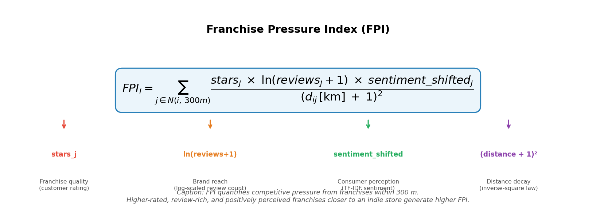

**[FPI 공식 구성 요소 다이어그램]**

$$FPI_i = \sum_{j \in N(i,\,r)} \frac{stars_j \;\times\; \ln(review\_count_j+1) \;\times\; sentiment\_shifted_j}{(d_{ij}[\mathrm{km}] + 1)^2}$$

| 요소 | 의미 | 설계 근거 |
|---|---|---|
| $stars_j$ | 프랜차이즈 품질 가중치 | 소비자 기대치를 높이는 고품질 프랜차이즈가 더 위협적 |
| $\ln(review\_count+1)$ | 브랜드 영향력 (인지도) | 리뷰 수 편차가 크므로 로그 스케일 적용 |
| $sentiment\_shifted$ | 소비자 체감 품질 | 단순 별점을 넘어 실질적 소비자 반응 반영 |
| $(d_{ij}+1)^{-2}$ | 거리 역제곱 감쇠 | 가까울수록 경쟁 압력이 강하게 작용 |

**Shift 정규화**: 감성점수의 음수값이 FPI 부호를 왜곡하는 문제를 발견하여, 전체 최솟값을 차감하는 Shift 정규화를 적용했다. 이를 통해 음수를 제거하면서 상대적 간격을 완전히 보존한다.

$$sentiment\_shifted = sentiment - \min(sentiment)$$

---

# 5. 데이터 전처리 및 탐색적 분석 (EDA)

## 5-1. 분석 지역·업종 선정

### 분석 목적
데이터 기반으로 분석에 최적인 도시와 업종 조합을 선정한다. FPI 분석이 유효하려면 업체 수·리뷰 수가 충분하고, 프랜차이즈와 독립 브랜드가 혼재하며, 상권이 밀집되어야 한다.

### 사용 데이터
`yelp_business.csv` (174,566개 전체), `yelp_review.csv` (5,261,668개 전체)

### 분석 방법
3개 후보 도시(Las Vegas / Phoenix / Charlotte)를 업체 수, 리뷰 수, 상권 밀집도 기준으로 비교하였다.

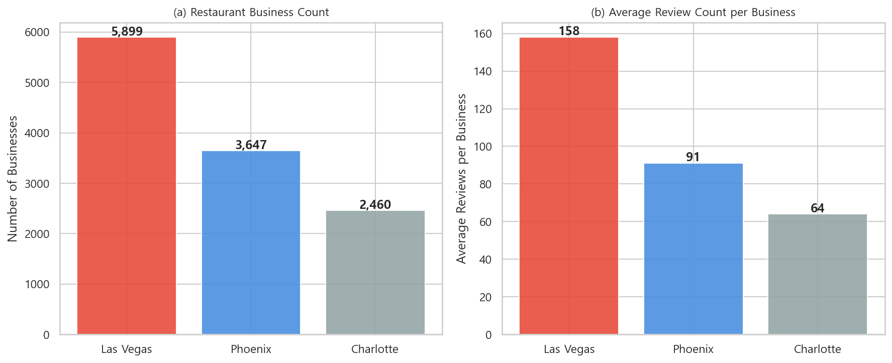

**[후보 도시 비교 차트 — Las Vegas / Phoenix / Charlotte 업체 수·리뷰 수·밀집도 비교]**

| 기준 | Las Vegas | Phoenix | Charlotte |
|---|---|---|---|
| 전체 업체 수 | **5,899개** | 3,647개 | 2,460개 |
| 평균 리뷰 수 | **158개** | 91개 | 64개 |
| 전체 리뷰 수 | **1,603,616개** | 576,700개 | 237,308개 |
| 상권 밀집 패턴 | Strip 중심 고밀집 | 격자형 분산 | 다운타운 집중 |

### 핵심 결과
Las Vegas는 업체 수와 리뷰 수 모두 2위 Phoenix의 1.6~2.8배로 압도적 1위다. Strip(Paradise 구역) 중심의 공간적 밀집 구조는 거리 기반 FPI 효과를 측정하기에 최적의 환경을 제공한다.

### 업종 선정: Restaurants
업종별 프랜차이즈 비율을 확인한 결과, Fast Food(69.6%)·Burgers(42.4%)는 프랜차이즈 비율이 높지만 독립 브랜드 절대 수가 적어 분석 표본이 부족했다. **Restaurants** 업종은 프랜차이즈 1,081개 + 독립 브랜드 4,818개로 분석 볼륨이 압도적이다.

### 인사이트
Las Vegas의 Strip 상권은 프랜차이즈와 독립 브랜드가 좁은 반경 내에 밀집된 자연 실험 환경(natural experiment setting)에 가깝다. 이는 FPI의 거리 가중치 효과를 극대화하는 구조다.

---

## 5-2. 프랜차이즈 판정

### 분석 목적
Yelp 데이터에는 프랜차이즈 여부를 나타내는 직접적인 레이블이 없다. 데이터 기반으로 프랜차이즈와 독립 브랜드를 구분하는 기준을 수립해야 한다.

### 분석 방법

**1단계: 브랜드명 정제**
```python
def clean_name(name):
    name = name.lower().strip()
    name = re.sub(r'[^a-z0-9\s]', '', name)
    return re.sub(r'\s+', ' ', name).strip()
```
소문자화, 특수문자 제거, 공백 정리를 통해 동일 브랜드가 다르게 인식되는 문제를 해결했다. (예: "Einstein Bros" + "Einstein Bros Bagels" → "einstein bros")

**2단계: 민감도 분석**

| 기준 | 프랜차이즈 브랜드 수 | 프랜차이즈 업체 수 | 비율 |
|---|---|---|---|
| 3개 이상 | 181개 | 1,598개 | 27.1% |
| 5개 이상 | 85개 | 1,278개 | 21.7% |
| **10개 이상** | **38개** | **984개** | **16.7%** |
| 15개 이상 | 24개 | 815개 | 13.8% |
| 20개 이상 | 20개 | 746개 | 12.6% |

**3단계: 화이트리스트 추가 (12개)**
10개 미달이지만 전국 체인임이 명확한 브랜드(Cafe Rio, Raising Cane's, Fatburger 등)를 수동 추가했다.

### 핵심 결과

| 구분 | 업체 수 | 비율 |
|---|---|---|
| 프랜차이즈 | 1,081개 | 18.3% |
| 독립 브랜드 | 4,818개 | 81.7% |

기초 비교: 독립 브랜드 평균 별점(3.63) > 프랜차이즈(2.71), 독립 브랜드 평균 리뷰 수(183개) > 프랜차이즈(42개).

### 인사이트
프랜차이즈의 낮은 별점은 Yelp 사용자의 독립 레스토랑 선호 편향, 관광객의 높은 기대치, 라스베가스 관광객의 리뷰 패턴 등 복합 요인의 결과로 해석된다. 이 기초 차이를 확인한 상태에서 FPI 분석을 진행한다.

### 다음 단계와의 연결
프랜차이즈 판정이 완료되어야 독립 브랜드의 FPI를 계산할 수 있다. 프랜차이즈는 FPI의 '공급원'이 되고, 독립 브랜드는 FPI의 '수용자'가 된다.

---

# 6. 분석 1: 자체 감성 사전 구축 (TF-IDF 기반)

## 분석 목적

별점만으로는 소비자의 실질적 체감 품질을 충분히 반영하지 못한다. FPI에 감성 가중치를 부여하기 위해, 별점을 ground truth로 활용하여 TF-IDF 기반 자체 감성 사전을 구축하고 VADER로 교차 검증한다.

## 사용 데이터

- `review_target.csv` (929,606개 리뷰, 별점 포함)
- `review_target_burger.csv` (178,094개, PART 2)

## 데이터 전처리

리뷰 텍스트에 대해 다음 전처리를 수행했다:
1. 소문자화
2. 숫자·구두점 제거
3. NLTK 불용어(stop words) 제거
4. 커스텀 불용어 73개 추가 제거
5. Porter Stemmer 어간 추출
6. 최소 길이 2자 이하 토큰 제거

**3점 리뷰 의도적 제외**: 긍정·부정 코퍼스 구성 시 3점 리뷰를 제외하여 사전 오염을 방지했다.

| 별점 | 분류 | PART 1 리뷰 수 | PART 2 리뷰 수 |
|---|---|---|---|
| 4~5점 | 긍정 코퍼스 | 614,312개 | 112,419개 |
| **3점** | **제외** | 125,290개 | 24,819개 |
| 1~2점 | 부정 코퍼스 | 190,004개 | 40,856개 |

## 분석 방법

**감성 사전 구축 절차**:
```
긍정 코퍼스 TF-IDF 상위 300개 추출
    + 부정 코퍼스 TF-IDF 상위 300개 추출
    → 교집합 제거 (양쪽에 동시 등장하는 애매한 단어)
    → 순수 긍정 사전 + 순수 부정 사전 확정
```

**감성점수 계산식**:
$$sentiment\_score = \frac{\text{긍정단어 수} - \text{부정단어 수}}{\text{전체 단어 수}}$$

## 핵심 결과

| 항목 | PART 1 | PART 2 |
|---|---|---|
| 긍정 사전 크기 | 84개 | 96개 |
| 부정 사전 크기 | 84개 | 96개 |
| 업체 감성점수 범위 | −0.111 ~ +0.089 | 유사 범위 |
| **VADER 상관계수** | **0.724** (p < 0.001) | **0.792** (p < 0.001) |

긍정 사전 예시: `awesome`, `tasty`, `crispy`, `delicious`  
부정 사전 예시: `awful`, `cold`, `dirty`, `salty`, `rude`

## 인사이트

VADER 상관계수 0.724(PART 1), 0.792(PART 2)는 자체 구축 사전이 기존 검증된 감성 분석 도구와 높은 일치도를 보임을 의미한다. 업종을 패스트푸드로 좁힐수록 리뷰 언어의 일관성이 높아져 감성점수 신뢰도가 향상되는 것을 확인했다. 이는 도메인 특화 감성 사전의 우수성을 실증적으로 보여준다.

## 다음 단계와의 연결

구축된 감성점수는 FPI 공식의 $sentiment\_shifted$ 항에 직접 투입된다. 감성점수의 신뢰도가 높을수록 FPI가 더 정확하게 프랜차이즈의 실질적 경쟁 강도를 반영한다.

---

# 7. 분석 2: FPI 산출 및 임계거리 도출

## 분석 목적

FPI를 실제로 산출하고, 민감도 분석을 통해 프랜차이즈 경쟁 압력이 유의미하게 작용하는 최적 반경(임계거리)을 결정한다.

## 사용 데이터

- `biz_sentiment.csv` / `biz_sentiment_burger.csv`
- 프랜차이즈 좌표, 별점, 리뷰 수, 감성점수

## 데이터 전처리

**Shift 정규화 (핵심 설계 결정)**:

산출 중 감성점수의 음수값으로 인해 FPI가 음수로 계산되는 문제를 발견했다. 이를 해결하기 위해 Shift 정규화를 적용했다:

```python
sentiment_shifted = sentiment - min(sentiment)
# PART 1: min = -0.1114 → 정규화 후 0.0 ~ 0.1561
# PART 2: 음수 594개(73.9%) → 전체 양수로 변환
```

이 방법은 음수를 제거하면서 모든 값의 상대적 간격을 보존한다.

**하버사인 거리 행렬**:
- PART 1: 4,818 × 1,081 = 약 521만 쌍 계산
- PART 2: 775 × 804 = 623,100쌍

## 분석 방법: 민감도 분석

100m, 200m, 300m, 500m 반경에서 FPI를 각각 산출하고, 단순 OLS 회귀로 별점·감성점수에 대한 유의성을 검정했다.

**[임계거리 민감도 분석 그래프 — 반경별 p-value 추이 (PART 1 / PART 2)]**

**PART 1 결과**:

| 반경 | 별점 p | 감성점수 p | 채택 여부 |
|---|---|---|---|
| 100m | 0.0001 | 0.2672 | — |
| 200m | 0.0002 | 0.5950 | — |
| **300m** | **<0.001** | **0.021** | **채택** |
| 500m | <0.001 | 0.002 | — |

**PART 2 결과**:

| 반경 | 별점 p | 감성점수 p | 채택 여부 |
|---|---|---|---|
| 100m | 0.123 | 0.127 | — |
| **300m** | **0.015** | 0.140 | **채택** |
| 500m | 0.001 | 0.191 | — |

**임계거리 확정 기준**: 별점과 감성점수 두 종속변수 모두 p < 0.05인 최소 반경 = **300m**  
(PART 2에서는 별점 기준 p < 0.05 만족하는 최소 반경으로 확정)

## 핵심 결과

**FPI 구간 분류** (FPI > 0 업체의 중앙값 기준):

| 구간 | 정의 | PART 1 | PART 2 |
|---|---|---|---|
| NP (No Pressure) | FPI = 0, 반경 내 프랜차이즈 없음 | 977개 (20.3%) | 183개 (23.6%) |
| LP (Low Pressure) | FPI ≤ 중앙값 | 1,921개 (39.9%) | 296개 (38.2%) |
| HP (High Pressure) | FPI > 중앙값 | 1,920개 (39.8%) | 296개 (38.2%) |

## 인사이트

임계거리 300m는 보행 5분 이내 거리로, 소비자가 식사 장소를 결정할 때 자연스럽게 비교하는 반경과 일치한다. 이는 FPI가 단순한 수학적 구성물이 아닌 소비자 행동의 물리적 패턴을 반영함을 시사한다.

PART 2에서 300m 미만(100m)에서 별점 p-value가 유의미하지 않은 이유는 패스트푸드 업종 특성상 300m 이내 프랜차이즈가 있는 독립 업체 비율(37.8%)이 너무 낮아 표본이 부족하기 때문이다(500m에서는 86.7%로 급증).

## 다음 단계와의 연결

임계거리 300m로 산출된 `fpi_300m`이 이후 모든 회귀분석 및 구간 비교의 기준 변수가 된다.

---

# 8. 분석 3: 회귀분석 — FPI가 별점에 미치는 영향 (PART 1)

## 분석 목적

FPI가 독립 브랜드의 별점에 미치는 영향을 통계적으로 검증한다. 매장 규모(리뷰 수)와 상권 특성(neighborhood)을 통제하여 FPI의 순수한 효과를 추출한다.

## 사용 데이터

`biz_indie_with_groups.csv` (영업 중인 독립 브랜드 3,017개)

## 분석 방법

**OLS + HC3 다중회귀**

$$stars = \beta_0 + \beta_1 \cdot FPI_{300m} + \beta_2 \cdot \log(review\_count+1) + \sum_k \beta_k \cdot neighborhood_k + \epsilon$$

HC3(Heteroscedasticity-Consistent) 강건 표준오차를 적용한 이유: 리뷰수가 많은 업체일수록 평균 별점의 분산이 작아지는 전형적인 이분산 구조가 존재하기 때문이다. HC3는 계수를 변경하지 않고 표준오차와 p-value의 신뢰성만 개선한다.

**통제변수 선정 근거**:

| 변수 | 별점 상관 | FPI 상관 | 채택 |
|---|---|---|---|
| log(review_count) | 0.1585 | 0.0741 | ✅ |
| neighborhood 더미 (16개) | 상권별 별점 차이 최대 0.44점 | FPI 범위 0.72~7.94 | ✅ |
| is_open | 0.1028 | −0.013 | ❌ (사전 필터링으로 대체) |

**ANOVA + Tukey HSD**: 통제변수 없이 FPI 구간 간 차이를 단순 비교하여 효과의 직관적 크기를 확인했다.

## 핵심 결과

**OLS + HC3 회귀분석**:

| 종속변수 | FPI 계수(β) | p-value | 결론 |
|---|---|---|---|
| 별점 | **−0.0119** | **0.033** ✅ | FPI 1 증가 시 별점 0.012점 유의미 감소 |
| 감성점수 | −0.0001 | 0.384 ❌ | 통제 후 유의미하지 않음 |

별점 모델: R² = 0.0717, Adj R² = 0.0661, F-stat p < 0.001

**ANOVA + Tukey HSD (별점, F = 19.72, p < 0.001)**:

**[FPI 구간별 평균 별점 비교 차트 — NP/LP/HP × PART 1/PART 2 그룹 막대 그래프]**

| 구간 | 평균 별점 | Tukey 결과 |
|---|---|---|
| NP (무풍지대) | **3.83** | HP vs NP: p < 0.001 |
| LP (저압력) | 3.69 | HP vs LP: p = 0.010 |
| HP (고압력) | 3.61 | LP vs NP: p < 0.001 |

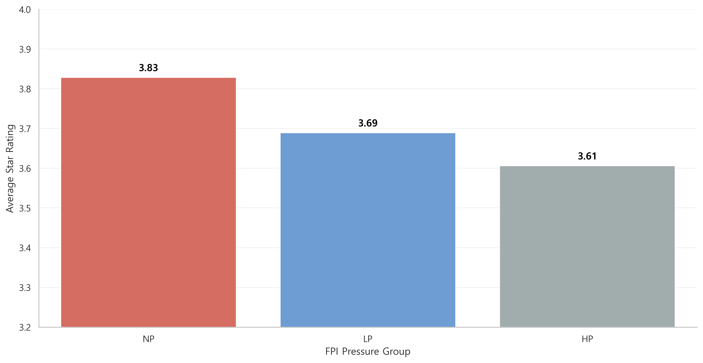

## 인사이트

**핵심 발견**: 프랜차이즈 경쟁 압력(FPI)이 높을수록 독립 브랜드의 별점이 통계적으로 유의미하게 낮아진다. NP → LP → HP 순의 단조 감소 패턴(3.83 → 3.69 → 3.61)이 세 구간 모두에서 유의미하게 확인되었다.

**R² 해석**: R² = 0.072는 낮아 보이지만, Yelp 별점에는 수백 가지 요인(음식 품질, 서비스, 분위기, 가격, 개인 취향 등)이 영향을 미친다. 이 맥락에서 FPI 단일 변수가 별점 분산의 7%를 설명한다는 것은 실질적 의미가 있다.

**감성점수 비유의 해석**: FPI가 소비자의 정량적 평가(별점)에는 영향을 미치지만, 리뷰 텍스트로 표현된 실질적 감성까지는 직접적으로 견인하지 못한다. 이는 소비자가 경쟁 환경을 인식하더라도 개별 매장 경험을 중심으로 텍스트를 작성하기 때문으로 해석된다.

## 다음 단계와의 연결

PART 1에서 FPI → 별점 음(−)의 관계가 확인되었다. 그러나 업종 이질성(태국 음식, 스시, 스테이크 등이 혼재)으로 인해 텍스트 분석에서 FPI 구간의 순수한 차이를 보기 어려운 한계가 있다. PART 2에서 업종을 패스트푸드로 좁혀 이 문제를 해결한다.

---

# 9. 분석 4: 텍스트 분석 — FPI 구간별 소비자 언어 (PART 1)

## 분석 목적

FPI 구간(NP/LP/HP)에 따라 독립 브랜드의 소비자 리뷰에서 등장하는 키워드가 어떻게 달라지는지 분석하여 경쟁 환경이 소비자 평가 언어에 미치는 영향을 탐색한다.

## 사용 데이터

- `review_target.csv` (929,606개 리뷰)
- `biz_indie_with_groups.csv` (FPI 구간 정보)
- 구간별 리뷰: NP 108,443개 / LP 300,586개 / HP 342,861개

## 분석 방법

**TF-IDF 차이 방식**:
```python
diff = (target_group_tfidf - other_groups_avg_tfidf).sort_values(ascending=False)
```

특정 구간의 TF-IDF 점수에서 나머지 구간의 평균 TF-IDF를 차감하여 해당 구간에서 '상대적으로 특징적인' 단어를 추출한다.

유효 단어 기준: 전체 500회 이상 등장 + 순수 알파벳 3자 이상 → 4,236개

## 핵심 결과

**구간별 고유 키워드**:

| 구간 | 상위 키워드 (TF-IDF 차이값 기준) |
|---|---|
| NP (무풍지대) | thai (0.040), coffee (0.035), pho (0.034), buffet (0.032), noodle (0.017) |
| LP (저압력) | pizza (0.023), steak (0.021), sushi (0.017), ramen (0.014), korean (0.008) |
| HP (고압력) | burger (0.043), drink (0.018), cheese (0.016), sandwich (0.015), waiter (0.009) |

**해석**:

| 구간 | 언어 패턴 | 전략적 의미 |
|---|---|---|
| NP | 에스닉 전문 요리 특화 | 프랜차이즈와 메뉴 겹침 최소화 |
| LP | 정통 외국 요리 전문성 | 제한적 경쟁 환경에서 전문성 유지 |
| HP | 서비스·경험 차별화 지향 | 메뉴 유사성 높아 서비스로 차별화 시도 |

## 인사이트

FPI가 높아질수록 독립 브랜드의 메뉴가 프랜차이즈와 유사해지고(burger, sandwich), 소비자는 서비스 경험(waiter, server)으로 독립 브랜드를 평가하는 경향이 강해진다. 반면 NP 구간에서는 에스닉 전문 요리가 두드러지는데, 이는 프랜차이즈가 진입하기 어려운 틈새 업종을 선택함으로써 경쟁 압력을 원천적으로 회피한 것으로 해석된다.

## 분석 한계 및 다음 단계와의 연결

PCA Biplot 결과(PC1 6.3%, PC2 4.7%, 누적 11.0%)에서 업종 이질성이 FPI 구간 차이보다 분산을 더 크게 설명하는 것으로 나타났다. 또한 카지노 상권 노이즈(hotel, casino, MGM 등 키워드가 지속 등장)가 음식·서비스 품질 차이를 가린다는 한계가 확인되었다. 이를 해결하기 위해 PART 2에서 패스트푸드 업종으로 범위를 좁혀 동일한 분석을 재수행한다.

---

# 10. 분석 5: 패스트푸드 업종 심화 분석 도입 (PART 2)

## PART 2의 목적과 배경

PART 1에서 두 가지 구조적 문제를 발견했다:
1. **업종 이질성**: 태국·스시·스테이크 등 다양한 업종이 혼재하여 FPI 구간의 순수한 차이 포착이 어려움
2. **카지노 상권 노이즈**: 생존/고전 브랜드 비교에서 hotel, casino, MGM 등 키워드가 지속 등장하여 음식·서비스 품질 신호를 가림

**해결책**: 분석 범위를 `Burgers + Sandwiches + Fast Food` 3개 카테고리로 좁혀 동질적 경쟁 환경을 구축한다.

## 업종 선정 근거

Pizza, Chicken 등은 배달 중심 소비나 저녁·가족 단위 수요 비중이 높아 입지 및 경쟁 구조가 상이할 가능성이 있어 제외했다. Burgers·Sandwiches·Fast Food는 점심·간식 중심 소비, 직접 방문 위주, 가격 경쟁 구조가 유사하다.

## 핵심 결과

| 항목 | 수치 |
|---|---|
| 전체 업체 | 1,579개 |
| 프랜차이즈 | 804개 (**50.9%**) |
| 독립 브랜드 | 775개 |
| 영업 중 독립 | 535개 |
| 분석 리뷰 | 178,094개 |

**주목**: 전체 Restaurants 대비 프랜차이즈 비율이 18.3% → **50.9%** 로 크게 높다. 패스트푸드 업종은 프랜차이즈 경쟁 압력이 구조적으로 더 강한 환경임을 의미한다.

## FPI 산출 결과 (PART 2)

| 구간 | 업체 수 | 비율 | 평균 별점 |
|---|---|---|---|
| NP | 183개 | 23.6% | 3.70 |
| LP | 296개 | 38.2% | 3.53 |
| HP | 296개 | 38.2% | 3.46 |

PART 2에서 감성점수는 전 반경에서 유의미하지 않았다(300m p = 0.140). 패스트푸드 리뷰 언어가 경쟁 환경보다 개별 매장 경험(속도, 가격, 직원)에 더 민감하기 때문으로 해석된다.

## PART 2 FPI 구간별 소비자 언어 패턴

PART 1 분석(Section 9)에서 확인한 FPI 구간별 언어 분화 패턴이 패스트푸드 업종에서도 재현되는지 검증했다.

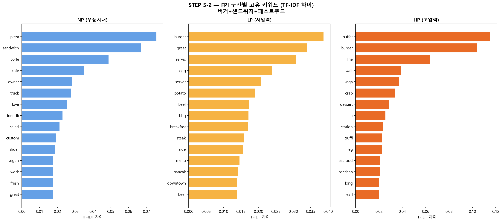

### 그래프 설명
패스트푸드·버거·샌드위치 업종 독립 브랜드의 FPI 구간별(NP/LP/HP) 고유 키워드를 TF-IDF 차이값 기준 상위 15개씩 수평 막대 차트로 표시한다. NP(파랑)/LP(노랑)/HP(주황) 세 패널로 구성된다.

### 해석
NP(무풍지대)에서는 pizza, sandwich, owner, truck, vegan, custom 등 소규모·자영업·음식트럭 특성이 두드러진다. LP(저압력)에서는 burger, great, service, egg, server, beef 등 제품 품질과 서비스 평가어가 상위를 차지한다. HP(고압력)에서는 buffet, burger, wait, line 등 대기 경험과 볼륨 관련 키워드가 지배적이다. 프랜차이즈 밀집이 심화될수록 소비자의 평가 언어가 음식 개성에서 운영 효율(대기, 줄) 중심으로 이동하며, 이는 PART 1에서 발견된 서비스 차별화 경향과 일치한다.

### 분석 맥락
PART 2에서 PART 1 텍스트 분석 결과를 재검증하는 단계다. 업종을 패스트푸드로 좁혔을 때도 FPI 구간별 언어 분화 패턴이 유지된다는 것은 이 패턴이 업종 이질성이 아닌 경쟁 환경 자체에서 비롯된 것임을 강화하는 근거가 된다. HP 구간의 wait·line 키워드는 이어지는 생존/고전 브랜드 분석에서 왜 고전 브랜드가 서비스 불만으로 귀결되는지를 예고한다.

## 인사이트

프랜차이즈 비율 50.9%의 의미: 패스트푸드 업종 독립 브랜드는 사실상 프랜차이즈 포화 환경에서 경쟁한다. 이는 일반 Restaurants(18.3%)에 비해 훨씬 가혹한 경쟁 조건이다. FPI 효과가 PART 2에서 더 강하게 나타나는 구조적 배경이 된다.

---

# 11. 분석 6: 회귀분석 심화 — FPI·별점·폐업 관계 (PART 2)

## 분석 목적

PART 1에서 확인된 FPI → 별점 관계가 업종 특화 환경에서도 재현되는지 검증하고, FPI가 폐업 여부에도 직접적인 영향을 미치는지 탐색한다.

## 사용 데이터

`biz_indie_with_groups_burger.csv` (독립 브랜드 775개: 영업 중 535개, 폐업 240개)

## 분석 방법

| 모델 | 종속변수 | 독립변수 | 통제변수 |
|---|---|---|---|
| OLS + HC3 | 별점 | fpi_300m | log(review_count), neighborhood 더미 16개 |
| Logistic + HC3 | 폐업여부(is_open) | fpi_300m | stars, log(review_count), neighborhood 더미 |

## 핵심 결과

### 모델 1: FPI → 별점 (OLS + HC3)

| 항목 | PART 1 | PART 2 |
|---|---|---|
| FPI 계수(β) | −0.0119 | **−0.0271** |
| p-value | 0.033 ✅ | 0.048 ✅ |
| 95% CI | [−0.023, −0.001] | [−0.054, −0.000] |
| R² | 0.0717 | 0.0825 |

**[FPI → 별점 회귀분석 계수 비교 — PART 1 vs PART 2 수평 막대 그래프]**

업종을 좁히니 FPI 효과가 **2.3배** 강하게 나타났다. 이는 동질적 경쟁 환경에서 FPI 신호가 더 선명하게 포착됨을 의미한다.

### 모델 2: FPI → 폐업여부 (Logistic + HC3)

| 변수 | 계수 | Odds Ratio | p-value |
|---|---|---|---|
| FPI_300m | −0.0342 | 0.966 | **0.401 ❌** |
| 별점(stars) | −0.2997 | 0.741 | 0.005 |
| log(리뷰수) | +0.4828 | **1.621** | **< 0.001 ✅** |

**FPI는 폐업 여부에 직접적인 영향을 미치지 않는다** (p = 0.401).  
반면, **리뷰 수가 많을수록 영업 지속 가능성이 높아진다** (OR = 1.621): 리뷰 수가 1% 증가할 때 영업 중 확률이 약 62% 높아진다.

### 매개효과 분석 (STEP 4-4)

FPI → 별점 → 폐업 매개 경로의 성립 여부를 검증하기 위해 Bootstrap 5,000회 간접효과 분석을 수행했다.

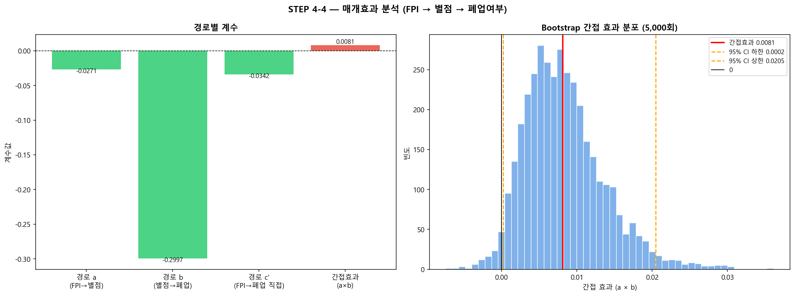

### 그래프 설명
좌측 패널은 FPI → 별점(경로 a: −0.0271), 별점 → 폐업(경로 b: −0.2997), FPI → 폐업 직접(경로 c': −0.0342), 간접효과(a×b: 0.0081) 4개 경로의 회귀 계수를 막대 차트로 나타낸다. 우측 패널은 Bootstrap 5,000회 반복으로 추정한 간접효과(a×b) 분포 히스토그램과 95% CI ([0.0002, 0.0205])를 표시한다.

### 해석
Bootstrap CI가 0을 포함하지 않아 간접효과(0.0081)는 통계적으로 유의미하나, FPI → 폐업 직접 경로(p=0.401)가 비유의적이다. 더 근본적으로, 폐업 브랜드 평균 별점(3.60)이 영업 중 브랜드(3.52)보다 오히려 높은 역설이 데이터에 나타난다. 별점 계수 자체가 음수(OR = 0.741)로, "별점이 높을수록 폐업 확률이 높아진다"는 직관에 반하는 결과가 도출된다. 이는 횡단면 데이터의 구조적 한계에서 비롯된 것으로, 매개효과가 실질적으로 성립하지 않음을 의미한다.

### 분석 맥락
이 분석은 FPI의 폐업 경로를 규명하려는 시도의 결정적 전환점이다. 통계적 수치만 보면 간접효과가 유의미해 보이지만, 데이터의 맥락(is_open은 2017년 스냅샷, 별점과 폐업의 역설적 관계)을 함께 고려하면 매개 경로가 성립하지 않는다는 결론이 도출된다. 이 그래프는 그 근거를 투명하게 보여주는 증거 자료다.

### 별점 구간별 영업 중 비율

| 별점 구간 | 영업 중 비율 |
|---|---|
| ~2.5점 | 79% |
| 3.0점 | 64% |
| 3.5점 | 65% |
| 4.0점 | 72% |
| 4.5~5.0점 | 67% |

별점과 영업 여부 사이에 단순한 선형 관계가 성립하지 않음을 확인했다.

## 인사이트

**FPI의 폐업 경로는 직접적이지 않다**: FPI가 높다고 해서 곧바로 폐업하는 것이 아니다. FPI는 별점을 통해 간접적으로 영향을 미치지만, 폐업 여부를 직접 결정하는 가장 강력한 변수는 **소비자 참여도(리뷰 수)**임이 확인되었다.

이는 중요한 처방적 시사점을 제공한다: 프랜차이즈 경쟁이 심한 환경에서 독립 브랜드가 생존하려면 단순히 별점을 유지하는 것을 넘어, **꾸준한 리뷰 유입을 통한 소비자 관계 형성**이 핵심임을 시사한다.

---

# 12. 분석 7: 심화 텍스트 분석 — 생존 전략 규명 (PART 2)

## 분석 목적

HP 구간 내에서 생존 브랜드(stars ≥ 4.0)와 고전 브랜드(stars ≤ 3.0)를 정의하고, 6가지 텍스트 분석 방법을 통해 생존을 결정하는 언어적 패턴을 규명한다.

## 사용 데이터

| 세그먼트 | 기준 | 업체 수 | 리뷰 수 |
|---|---|---|---|
| 생존 브랜드 | HP + is_open + stars ≥ 4.0 + reviews ≥ 10 | 63개 | 30,913개 |
| 고전 브랜드 | HP + is_open + stars ≤ 3.0 + reviews ≥ 10 | 65개 | 9,982개 |
| 프랜차이즈 | — | — | 35,587개 |

---

## 7-1. TF-IDF 차이 분석 (STEP 5-4)

### 방법
생존 브랜드 리뷰와 고전 브랜드 리뷰에 각각 TF-IDF를 적용하고 차이값으로 그룹별 특징 단어를 추출한다.

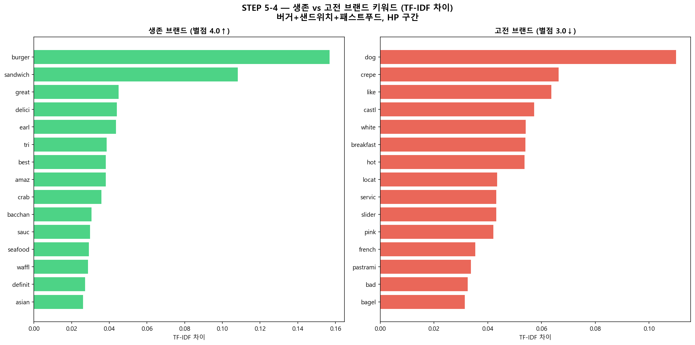

### 그래프 설명
HP 구간 생존 브랜드(별점 4.0↑, 좌측 초록)와 고전 브랜드(별점 3.0↓, 우측 빨강)의 TF-IDF 차이값 상위 15개 키워드를 수평 막대 차트로 나열한다. 생존 측에는 burger, sandwich, great, delici, amaz, crab, waffl 등이, 고전 측에는 dog, crepe, castl, like, bad, locat, servic 등이 위치한다.

### 해석
생존 브랜드는 음식 품질 형용사(great, delici, amaz, flavor)와 구체적 메뉴명(burger, crab, waffle)이 지배적이다. 고전 브랜드에서는 hot dog, White Castle(castl), crepe 같은 저가·단순 메뉴명과 bad, never 같은 부정어, 그리고 locat(location)이 상위권에 오른다. 같은 HP 상권 내에서도 소비자의 평가 언어가 품질·경험 중심과 가격·운영 문제 중심으로 완전히 분리된다는 것이 핵심이다.

### 분석 맥락
생존 전략 규명의 출발점으로, 단어 수준에서 두 그룹의 언어적 거리를 정량화하는 가장 직접적인 근거다. 이후 분석(N-gram, LDA, 시계열)에서 다양한 방법으로 재확인되는 패턴이 처음으로 드러나는 지점이다.

### 인사이트 요약
생존 브랜드는 음식 품질 형용사(great, delicious, amazing, flavor)가 압도적이다. 고전 브랜드는 특정 메뉴명(hot dog, crepe, white castle slider)이 상위권이며, bad, never 같은 부정어가 포함된다.

---

## 7-2. N-gram 분석 (STEP 5-5)

### 방법
Bigram(2단어 조합)과 Trigram(3단어 조합)을 추출하여 단어 조합 단위의 패턴을 분석한다.

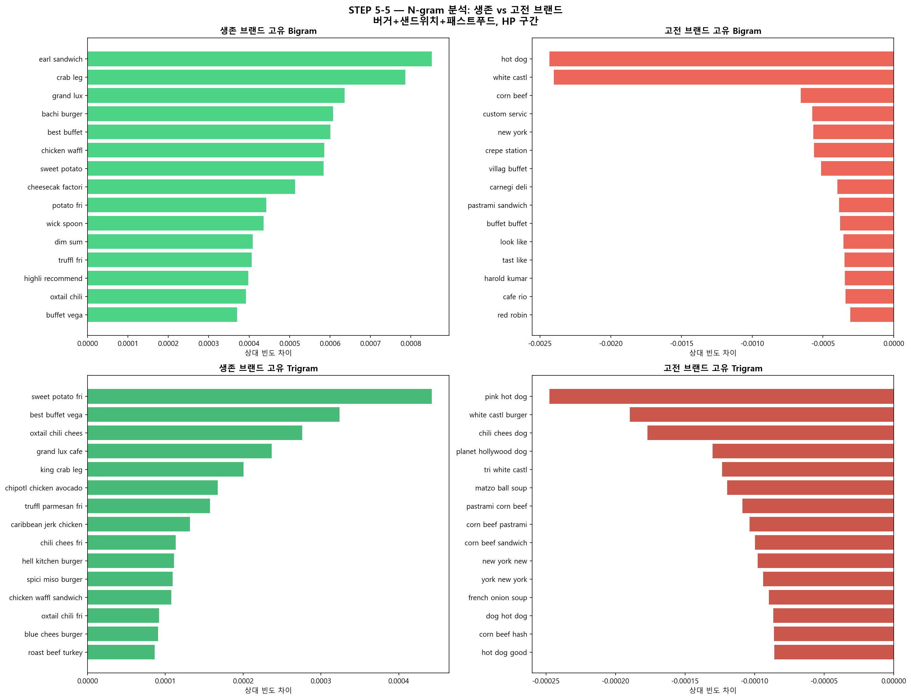

### 그래프 설명
HP 구간 생존(초록) vs 고전(빨강) 브랜드의 고유 Bigram(상단 2패널)과 Trigram(하단 2패널)을 상대 빈도 차이 기준으로 각각 수평 막대 차트로 표시한다. 생존 Bigram 상위: earl sandwich, crab leg, grand lux, bachi burger. 생존 Trigram 상위: sweet potato fry, oxtail chili chees, truffle parmesan fry. 고전 Bigram: hot dog, white castl, corn beef. 고전 Trigram: pink hot dog, white castl burger, planet hollywood dog.

### 해석
생존 브랜드 소비자는 단순 단어가 아닌 복합 메뉴 조합 전체를 언어화한다('sweet potato fry', 'truffle parmesan fry'). 이는 소비자가 특정 메뉴 경험을 브랜드 정체성으로 기억한다는 의미다. 반면 고전 브랜드는 일반화된 저가 메뉴명(hot dog, white castle)과 관광 연계 표현(planet hollywood)이 주를 이루며, 브랜드 고유의 언어 자산이 없음을 보여준다.

### 분석 맥락
TF-IDF 단어 분석을 보완하는 N-gram 분석은 소비자가 생존 브랜드를 어떻게 '기억'하는지를 보여준다. 단어가 아닌 '조합'으로 기억된다는 것은 시그니처 메뉴가 실제로 소비자 언어에 흔적을 남긴다는 증거다. 이 패턴은 생존 전략으로서 '메뉴 개성화'의 중요성을 직접 입증한다.

---

## 7-3. VADER 감성 강도 분석 (STEP 5-6)

### 방법
각 리뷰에 VADER를 적용하여 compound 점수를 산출하고, 생존·고전·프랜차이즈 3그룹을 비교한다. Mann-Whitney U 검정으로 통계적 유의성을 확인한다.

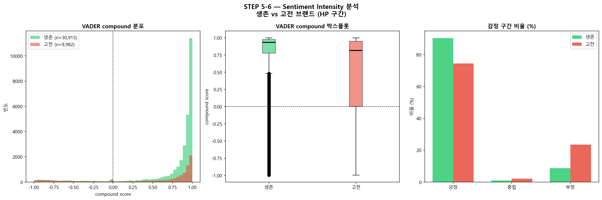

### 그래프 설명
생존(n=30,913)과 고전(n=9,982) 브랜드 리뷰의 VADER compound 점수를 세 가지 방식으로 시각화한다. (좌) 전체 점수 분포 히스토그램(겹침 표시), (중) 그룹별 박스플롯, (우) 긍정/중립/부정 구간 비율 막대 차트. 생존은 초록, 고전은 빨강.

### 해석
생존 브랜드의 compound 점수는 0.75~1.0 구간에 강하게 집중되어 있고, 부정 리뷰 비율이 약 10%에 불과하다. 고전 브랜드는 분포가 전 구간에 분산되고, 부정 비율이 약 25%에 달한다. 박스플롯에서 생존 브랜드의 25th percentile이 고전 브랜드의 75th percentile과 거의 동일 수준이다. 이는 단순한 평균 차이가 아닌, 감성의 분포 형태 자체가 구조적으로 다름을 보여준다. 평균 VADER 강도: 생존 0.738, 고전 0.454 (Mann-Whitney p < 0.001).

### 분석 맥락
별점(0.5점 단위 이산값)을 보완하는 연속형 감성 지표로서, 두 그룹 사이의 감성 차이가 단순히 "별점 기준으로 분류했기 때문"이 아닌 실제 리뷰 텍스트의 언어적 차이에서 비롯됨을 입증한다. Mann-Whitney p < 0.001은 이 차이가 우연이 아님을 통계적으로 확인한다.

---

## 7-4. LDA 토픽 모델링 (STEP 5-7)

### 방법
각 그룹의 리뷰를 대상으로 LDA(Latent Dirichlet Allocation) 토픽 모델을 적용한다(토픽 수 = 5). 토픽의 구성 단어로 그룹별 리뷰의 주요 주제를 파악한다.

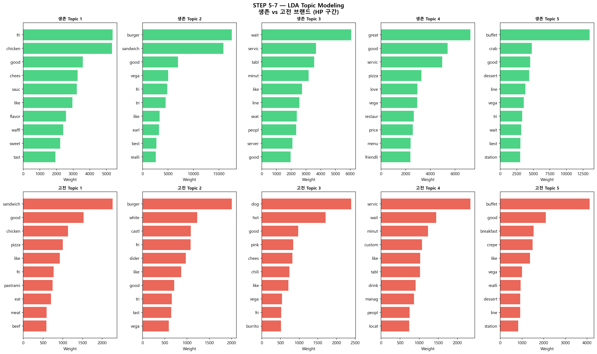

### 그래프 설명
생존 브랜드(상단 초록, 5개 토픽)와 고전 브랜드(하단 빨강, 5개 토픽)의 LDA 결과를 각 토픽 구성 단어 weight 기준 수평 막대 차트 10개 패널로 표시한다.

### 해석
생존 토픽 구성: (1) 치킨·프라이·와플·소스 특화 메뉴, (2) 버거·샌드위치 고품질(best, really), (3) 서비스 경험(wait, service, table, seat, server — 경험 기술), (4) 전반적 평가(great, good, service, love, price), (5) 뷔페·크랩·해산물 다이닝. 고전 토픽 구성: (1) 일반 샌드위치·치킨·피자, (2) White Castle 슬라이더, (3) 핫도그·칠리, (4) 서비스 불만(servic, wait, minut, manag, locat, drink), (5) 뷔페·아침식사. 핵심 차이는 서비스 토픽의 성격이다. 생존에서는 서비스가 긍정 경험으로, 고전에서는 대기·관리자·위치 불만으로 기술된다.

### 분석 맥락
TF-IDF가 단어 수준의 차이를 보여준다면, LDA는 리뷰 전체의 '주제 구조'를 밝힌다. 두 그룹 모두 서비스 관련 토픽이 존재하지만 맥락이 정반대라는 발견은 단어 수준 분석에서 포착하기 어려운 깊이를 더한다. 이는 소비자 경험의 구조적 차이를 방법론적으로 교차 검증하는 역할을 한다.

---

## 7-5. 프랜차이즈 직접 언급 분석 (STEP 5-10)

### 방법
생존·고전·프랜차이즈 그룹의 리뷰에서 특정 표현의 빈도를 10,000 리뷰당 횟수로 정규화하여 비교한다.

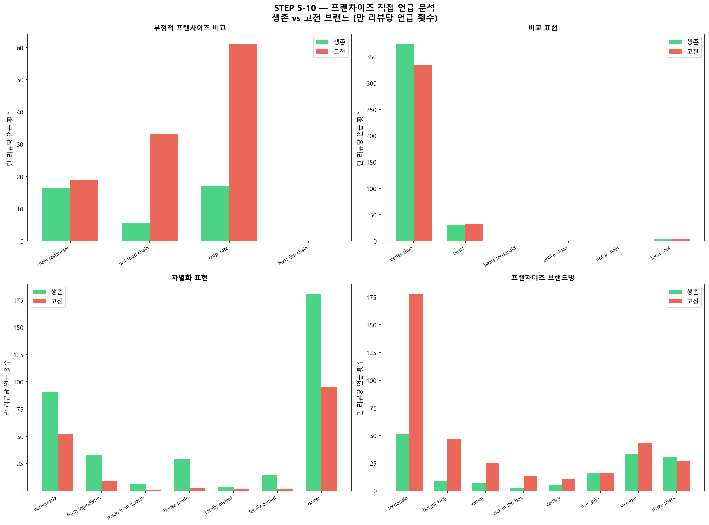

### 그래프 설명
4개 카테고리로 구분된 표현 빈도를 생존(초록)과 고전(빨강) 그룹별로 만 리뷰당 언급 횟수로 비교한다. (좌상) 부정적 프랜차이즈 비교 표현(chain restaurant, fast food chain, corporate, feels like chain), (우상) 비교 표현(better than, beats, beats mcdonald, unlike chain), (좌하) 차별화 표현(homemade, fresh ingredients, house made, locally owned, family owned, owner), (우하) 프랜차이즈 브랜드명 직접 언급(mcdonald, burger king, wendy's 등).

### 해석
생존 브랜드는 homemade(90회), fresh ingredients(33회), house made(29회), family owned(14회), owner(180회) 등 독립성·수제성 표현이 고전 대비 3~10배 높다. 고전 브랜드는 corporate(61회), fast food chain(33회) 등 '체인처럼 느껴진다'는 표현이 압도적으로 많고, McDonald's 언급 빈도도 훨씬 높다. McDonald's 맥락을 보면: 생존은 "way better than McDonald's", 고전은 "McDonald's would have been better"로 완전히 반전된다.

### 분석 맥락
McDonald's가 소비자의 최소 기준선(baseline)으로 기능한다. 이 기준선을 넘었는가 넘지 못했는가가 생존과 고전을 가르는 결정적 기준이 된다. 소비자가 자발적으로 homemade·house made·family owned를 사용한다는 것은 메뉴 선택이 아닌 브랜드 아이덴티티를 소비한다는 의미다. 이 그래프는 마케팅 전략(수제성·오너십 강조)이 소비자 언어에 실제로 반영된 증거를 제공한다.

---

## 7-6. 시계열 감성 변화 분석 (STEP 5-9)

### 방법
연도별 평균 VADER 점수를 산출하여 생존·고전 브랜드의 시간에 따른 감성 변화 추세를 비교한다.

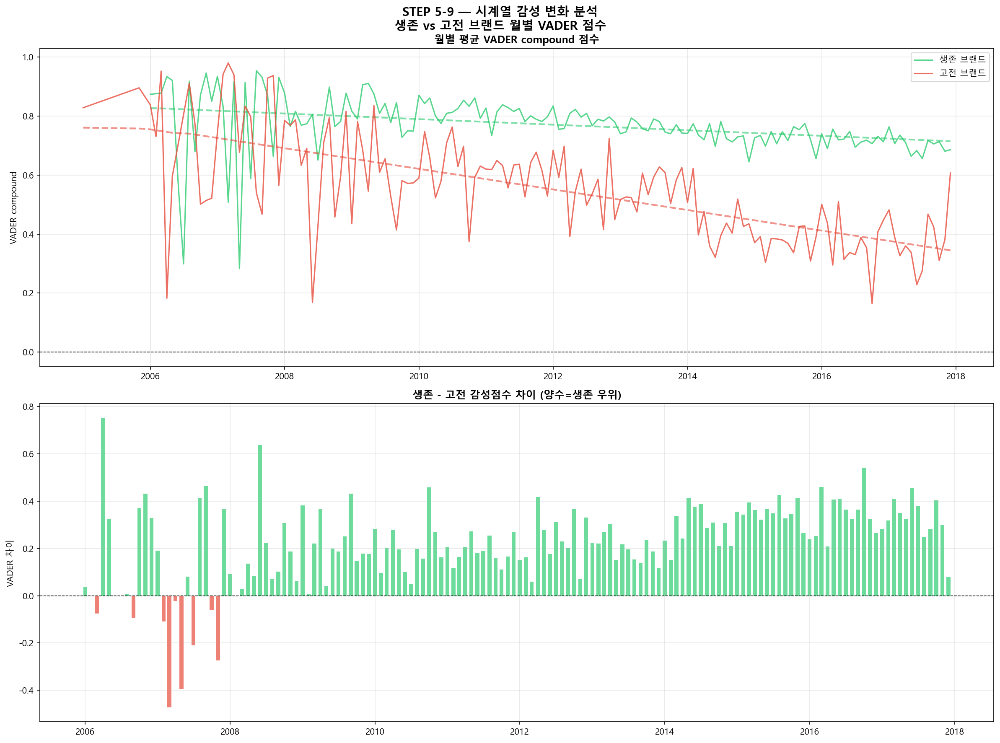

### Figure
`results/step5_burger_timeseries.png`

### 그래프 설명
상단: 2006~2018년 분기별 VADER compound 점수 평균을 생존(초록)·고전(빨강) 브랜드별 선그래프로 나타내며, 선형 추세선(점선)을 함께 표시한다. 하단: 두 그룹의 감성점수 차이(생존 − 고전)를 분기별 막대 그래프로 시각화한다.

### 해석
생존 브랜드는 0.7~0.9 구간에서 완만하게 유지(추세 기울기 약 −0.078)되는 반면, 고전 브랜드는 2008~2010년을 기점으로 급격히 하락하여 2015년 이후 0.2~0.4 수준에 고착된다(추세 기울기 약 −0.300). 2006~2008년 초기에는 두 그룹의 차이가 상대적으로 작았으나, 시간이 지나며 격차가 점점 벌어지는 패턴이 명확하다.

### 분석 맥락
이 시계열 분석은 "한때는 좋았는데" 패턴을 데이터로 입증하는 결정적 증거다. 고전 브랜드의 문제가 처음부터 나쁜 것(선천적)이 아니라 시간이 지나며 품질 유지에 실패한 것(후천적)임을 보여준다. 이는 창업자에게 "초기 성공에 과신하지 말라"는 처방적 인사이트를 데이터로 뒷받침한다.

실제 리뷰: *"This place has gone downhill from years ago. In the past it was really awesome... now it's cafeteria style."*

---

## 7-7. 시기별 키워드 변화 분석

### 방법
초기(2005~2008)와 후기(2014~2017)의 TF-IDF 차이 및 Bigram 출현 패턴을 비교하여 각 그룹의 언어적 진화 경로를 추적한다.

### 고전 브랜드 하락 경로 (STEP 5-11)

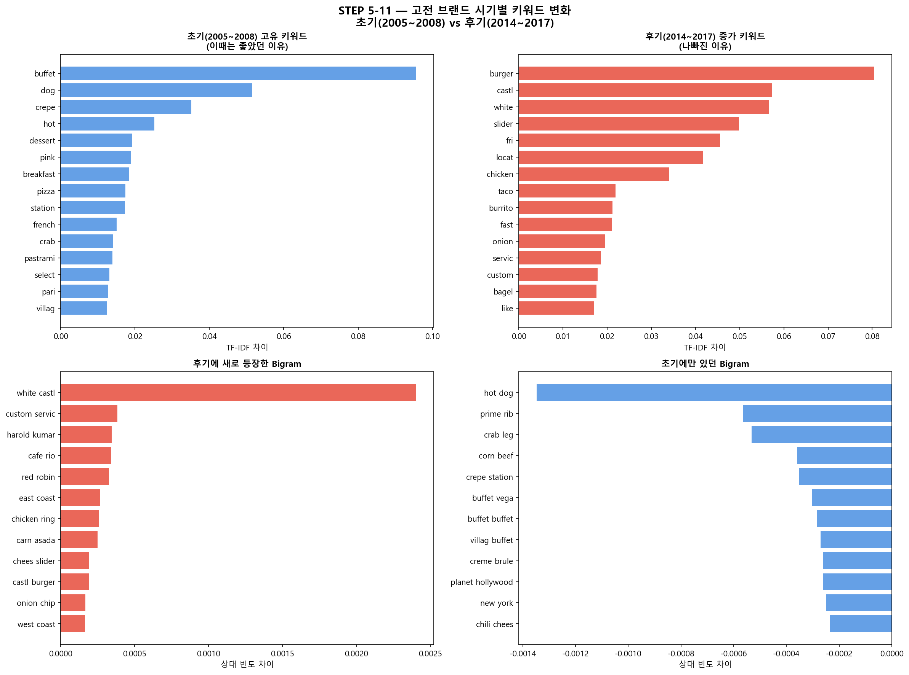

### 그래프 설명
고전 브랜드의 4개 패널: (좌상) 초기(2005~2008) 고유 키워드 — 이때는 좋았던 이유, (우상) 후기(2014~2017) 강화 키워드 — 나빠진 이유, (좌하) 후기에 새로 등장한 Bigram, (우하) 초기에만 있었던 Bigram.

### 해석
초기 고전 브랜드는 buffet, dog(Pink's 핫도그), crepe, hot, dessert 등 일부 차별화 메뉴를 보유했고, 초기 Bigram에는 hot dog, prime rib, crab leg, corn beef 등 특색 있는 메뉴 조합이 존재했다. 그러나 후기로 가면 burger, castl(White Castle), slider, fri, locat 등 저가·획일 메뉴 키워드가 급증하고, 후기 신규 Bigram으로 white castl, custom servic, cafe rio, red robin 등 프랜차이즈 연관 표현이 등장한다. 초기의 메뉴 개성이 소실되고 저가·획일화 방향으로 전환한 경로가 언어 데이터로 포착된다.

### 분석 맥락
고전 브랜드는 처음부터 나쁜 것이 아니라 초기에 일부 차별화를 시도했다가 이를 유지하지 못하고 저가 메뉴 전환이라는 선택을 한 결과임을 데이터가 보여준다. 이 분석은 단순한 별점 하락이 아닌 메뉴 전략 실패의 언어적 흔적을 추적한다는 점에서, 하락 경로의 인과 구조를 규명하는 핵심 근거다.

---

### 생존 브랜드 강화 경로 (STEP 5-12)

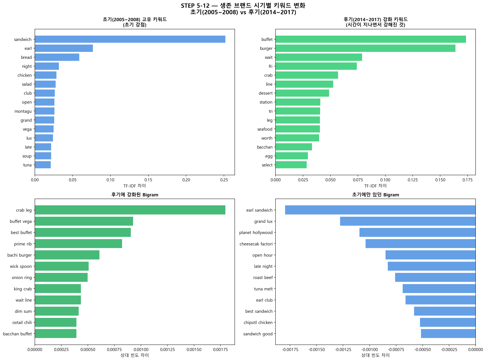

### 그래프 설명
생존 브랜드의 4개 패널: (좌상) 초기(2005~2008) 고유 키워드, (우상) 후기(2014~2017)에 강화된 키워드, (좌하) 후기에 강화된 Bigram, (우하) 초기에만 있었던 Bigram.

### 해석
생존 브랜드의 초기에는 sandwich, earl, bread, night 등 초창기 메뉴 중심이었으나, 후기로 갈수록 buffet, burger, crab, line, seafood, bacchan 등 프리미엄 다이닝 경험 관련 키워드가 강화된다. 후기에 강화된 Bigram은 crab leg, buffet vega, best buffet, prime rib, bachi burger, wick spoon 등으로, 구체적 시그니처 메뉴 조합이 더욱 선명해진다. 이는 생존 브랜드가 시간이 지날수록 메뉴 정체성을 약화시키는 것이 아니라 오히려 강화하는 방향으로 진화했음을 보여준다.

### 분석 맥락
고전 브랜드(개성 소실)와 생존 브랜드(정체성 강화)의 시기별 변화를 나란히 두면, '생존 = 정체성의 지속적 강화'라는 처방이 데이터에서 직접 도출된다. 규모가 커질수록(리뷰 증가) 생존 브랜드는 시그니처를 더 공고히 했고, 고전 브랜드는 원가·운영 압력을 메뉴 단순화로 대응했다.

---

**시기별 키워드 분석 종합**:

| 시기 | 고전 브랜드 평균 VADER | 주요 키워드 |
|---|---|---|
| 초기 (2005~2008) | 0.682 | buffet, crab leg, prime rib, crepe (차별화 메뉴) |
| 후기 (2014~2017) | 0.382 | white castle, employee, staff, frozen (저가화 + 직원 문제) |

```
[고전 브랜드 하락 경로]
초기 차별화 메뉴 (뷔페·델리·해산물)
    ↓
리뷰 급증 (소비자 유입: 297개 → 6,582개)
    ↓
품질 유지 실패 (employee, staff, manager 불만 키워드 급증)
    ↓
저가 메뉴로 전환 (white castle, frozen, hot dog)
    ↓
"McDonald's보다 못하다" (최소 기준선 미달)
    ↓
도태 (별점 3.0 이하 고착화)
```

---

## 7-8. 생존 브랜드 vs 프랜차이즈 차별화 분석 (STEP 5-8)

### 방법
생존 독립 브랜드와 프랜차이즈의 리뷰 언어를 TF-IDF 차이 방식으로 비교하여 포지셔닝 차이를 분석한다.

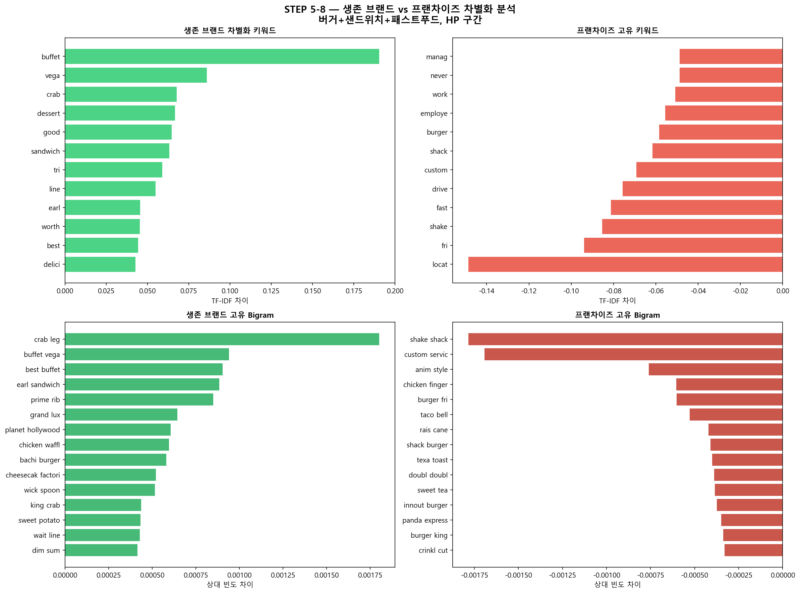

### 그래프 설명
HP 구간 생존 브랜드(초록)와 프랜차이즈(빨강)의 TF-IDF 차이 키워드(상단 2패널: 단어 수준)와 Bigram 상대 빈도 차이(하단 2패널)를 비교한다. 생존 차별화 키워드 상위: buffet, vega, crab, dessert, sandwich, worth, delici. 프랜차이즈 고유 키워드 상위: locat, manag, employe, drive, fast, shake. 생존 고유 Bigram: crab leg, buffet vega, earl sandwich, prime rib, chicken waffl. 프랜차이즈 고유 Bigram: shake shack, custom servic, taco bell, rais cane, burger king.

### 해석
생존 독립 브랜드는 경험·가치 중심(buffet, crab, dessert, worth, delici)으로 언어화되며, Bigram에도 구체적 메뉴 경험이 반영된다. 프랜차이즈는 위치(locat)·직원(manag, employe)·편의성(drive, fast)·브랜드명(shake shack, taco bell)이 고유하며, Bigram에도 브랜드명과 운영 특성이 지배적이다. 두 그룹은 같은 상권에서 경쟁하지만 소비자가 평가하는 언어 차원이 완전히 다르다.

### 분석 맥락
이 분석은 생존 독립 브랜드가 프랜차이즈와 '다른 영역'에서 경쟁함을 보여준다. 프랜차이즈가 편의성·효율·접근성을 놓고 경쟁한다면, 생존 독립 브랜드는 경험·품질·가치를 놓고 경쟁한다. 이 포지셔닝 분리가 생존의 핵심 메커니즘임을 언어 데이터가 입증한다.

---

## 텍스트 분석 종합 결과

6개 분석 방법이 모두 동일한 방향을 가리킨다:

| 분석 방법 | 생존 브랜드 핵심 특성 |
|---|---|
| TF-IDF 차이 (STEP 5-4) | 음식 품질 형용사 (delicious, amazing, flavor) |
| N-gram (STEP 5-5) | 시그니처 메뉴 복합 표현 (crab leg, truffle parmesan fry) |
| VADER 강도 (STEP 5-6) | 0.738 (고전 0.454 대비 +62%) |
| LDA 토픽 (STEP 5-7) | 음식 전문성 vs 운영 불만 |
| 프랜차이즈 언급 (STEP 5-10) | homemade / house made / family owned 압도적 |
| 시계열 (STEP 5-9) | 완만 하락(−0.078) vs 급격 하락(−0.300) |

---

# 13. 분석 8: FPI 공간 분포 지도 시각화

## 분석 목적

FPI 분석 결과를 창업자·운영자·상권 컨설턴트가 직접 활용 가능한 인터랙티브 지도로 시각화한다.

## 산출물

| 파일 | 내용 |
|---|---|
| [fpi_map_burger.html](figures/fpi_map_burger.html) | 연속형 FPI 지도 (색상: 빨강=고압력, 초록=저압력, 마커 크기=리뷰수) |
| [fpi_map_burger_group.html](figures/fpi_map_burger_group.html) | FPI 구간별 지도 (NP=파랑, LP=주황, HP=빨강) |
| [fpi_map_burger_survival.html](figures/fpi_map_burger_survival.html) | 생존/고전 브랜드 위치 지도 |

세 지도는 모두 Plotly 기반 인터랙티브 HTML 파일로, 브라우저에서 직접 열어 업체명·FPI 수치·별점·리뷰수 등을 hover 확인할 수 있다.

## 핵심 공간 패턴

**FPI 분포 통계** (패스트푸드 업종):
- 평균 FPI: 1.89
- 중앙값: 1.27
- 최대: 14.89
- 90th percentile: 4.70

**상권 유형별 특성**:

| 상권 유형 | FPI 수준 | 대표 neighborhood |
|---|---|---|
| Strip/Paradise (관광축) | 고압력 (3~5) | The Strip (평균 FPI 3.34) |
| 주요 대로변 | 중간 (1~3) | Spring Valley (2.65), Southeast (1.68) |
| 외곽 주거지 | 저압력 (0~1) | Downtown (0.86), Southwest (0.87) |

## 핵심 인사이트: 입지보다 전략

**가장 중요한 발견**: 동일 HP 구역(The Strip) 내에서 생존 브랜드(63개)와 고전 브랜드(65개)가 혼재한다. 이는 **입지 자체가 운명을 결정하지 않음**을 의미한다. 같은 고압력 상권에서 어떤 브랜드는 stars ≥ 4.0을 유지하고 어떤 브랜드는 stars ≤ 3.0으로 고전한다. 차이를 만드는 것은 위치가 아니라 **브랜드 전략과 품질 지속성**이다.

---

# 14. 연구 질문 종합 답변

## RQ1. 프랜차이즈 경쟁 압력(FPI)이 높을수록 독립 브랜드의 별점은 어떻게 달라지는가?

**답변: FPI가 높을수록 독립 브랜드의 별점이 유의미하게 낮아진다.**

| 근거 분석 | 결과 |
|---|---|
| PART 1 OLS+HC3 | β = −0.012, p = 0.033 (유의미) |
| PART 2 OLS+HC3 | β = −0.027, p = 0.048 (유의미, 2.3배 강화) |
| PART 1 ANOVA | NP(3.83) > LP(3.69) > HP(3.61) (F = 19.72, p < 0.001) |
| PART 2 ANOVA | NP(3.70) > LP(3.53) > HP(3.46) |

핵심 시사점: 업종 이질성을 제거할수록(PART 1 → PART 2) FPI 효과가 더 선명하게 드러난다. 이는 경쟁 환경이 실질적으로 독립 브랜드에 부정적 영향을 미침을 강하게 지지한다.

---

## RQ2. 임계거리(경쟁 유효 반경)는 얼마인가?

**답변: 300미터.**

민감도 분석에서 PART 1과 PART 2 모두 300m가 최적 임계거리로 확정되었다. 이는 보행 5분 이내 거리로, 소비자의 식사 장소 비교 행동과 일치하는 물리적 의미를 가진다.

---

## RQ3. FPI 구간별로 소비자 언어 패턴이 달라지는가?

**답변: 그렇다. FPI 구간에 따라 소비자가 사용하는 키워드가 체계적으로 달라진다.**

| 구간 | 언어 패턴 | 전략 해석 |
|---|---|---|
| NP | 에스닉 전문 요리 (pho, thai) / 자영업 특성 (owner, truck) | 프랜차이즈 진입 어려운 틈새 선택 |
| LP | 품질 평가 언어 (great, service, egg) | 전문성으로 제한적 경쟁 환경 유지 |
| HP | 대기·볼륨 중심 (wait, line, buffet) | 경쟁 포화로 운영 효율이 소비자 관심사 |

---

## RQ4. 고압력 환경 생존 브랜드의 언어적 특징은 무엇인가?

**답변: 3가지 핵심 특성이 일관되게 확인된다.**

**1. 시그니처 메뉴 전문성**: 단순 메뉴명이 아닌 복합 표현("oxtail chili cheese", "truffle parmesan fry")이 소비자 리뷰에 자발적으로 등장한다.

**2. 수제·오너십 정체성**: homemade(90.6회/만), house made(29.4회/만), family owned(13.9회/만) 표현이 고전 브랜드 대비 3~10배 높다.

**3. 강한 감정 강도 + 지속성**: 평균 VADER 0.738, 시계열 기울기 −0.078로 장기간 강한 긍정 반응을 유지한다.

---

# 15. 핵심 비즈니스 인사이트

## 창업자를 위한 입지 전략

| FPI 수준 | 상권 특성 | 권장 전략 |
|---|---|---|
| NP (FPI = 0) | 외곽 주거지, 에스닉 밀집 | 단골 기반 커뮤니티형, 에스닉 전문점 |
| LP (낮음) | 주요 대로변 | 정통 전문성 (스시, 라멘, 스테이크 등) |
| HP (높음) | Strip, 관광 상권 | 시그니처 메뉴 + 셰프 브랜딩 필수 |

## 독립 브랜드 운영자를 위한 차별화 전략

**생존 공식 = 시그니처 메뉴 × 수제·오너십 × 품질 지속성**

1. **McDonald's 기준선을 명확히 초과하라**: 소비자는 패스트푸드 업종에서 McDonald's를 최소 기준으로 설정한다. 이 기준선을 어떤 차원(맛·신선함·경험)에서든 명확히 초과해야 생존이 가능하다.

2. **시그니처 메뉴를 언어화하라**: 소비자가 "truffle parmesan fry", "oxtail chili cheese" 같은 복합 표현을 사용하도록 만드는 것이 브랜드 기억 점유의 핵심이다.

3. **초기 성공에 과신하지 마라**: 고전 브랜드의 가장 큰 실패 원인은 초기 좋은 리뷰 이후 품질 유지 실패였다. 규모가 커질수록 품질 관리 시스템이 더 중요해진다.

4. **소비자 참여를 유지하라**: 폐업의 직접 예측 변수는 리뷰 수다(OR = 1.621). 별점이 중간이어도 리뷰 수가 많으면 생존 확률이 높아진다. 꾸준한 소비자 관계가 중요하다.

## 상권 컨설턴트·프랜차이즈 본사를 위한 시사점

- **임계거리 300m**: 프랜차이즈 신규 출점 시 반경 300m 이내의 독립 브랜드에 의미 있는 경쟁 압력을 가하게 된다. 상생 마케팅 전략 수립에 이 기준을 활용할 수 있다.
- **업종별 경쟁 강도**: 패스트푸드 업종(프랜차이즈 비율 50.9%)은 일반 Restaurants(18.3%)에 비해 구조적으로 훨씬 치열한 경쟁 환경이다.

---

# 16. 계획 대비 수행 결과

**[분석 계획 대비 수행 결과 — 항목별 완료/미수행 현황표]**

| 항목 | 상태 | 비고 |
|---|---|---|
| 데이터 준비 및 프랜차이즈 판정 | 완료 | 수동 화이트리스트 12개 추가 |
| TF-IDF 감성 사전 구축 | 완료 | VADER 검증 r = 0.724/0.792 |
| FPI 산출 및 민감도 분석 | 완료 | 임계거리 300m 확정 |
| OLS 회귀분석 (FPI → 별점) | 완료 | HC3 강건 표준오차 적용 |
| OLS 회귀분석 (FPI → 리뷰수) | 완료 | 결과 비유의 (p = 0.413) |
| TF-IDF 구간별 키워드 분석 | 완료 | PCA Biplot 포함 |
| 생존 브랜드 키워드 분석 | 완료 | |
| FPI 인터랙티브 지도 | 완료 | 3종 HTML 파일 |
| N-gram 분석 (PART 2) | 완료 | Bigram/Trigram |
| VADER 강도 + Mann-Whitney | 완료 | p < 0.001 |
| LDA 토픽 모델링 (PART 2) | 완료 | 5개 토픽 |
| 시계열 감성 분석 | 완료 | 2005~2017년 |
| 프랜차이즈 직접 언급 분석 | 완료 | McDonald's 맥락 분석 포함 |
| 매개효과 분석 (FPI→별점→폐업) | **부분 수행** | 횡단면 데이터 한계로 성립하지 않음 |
| 생존 분석 (Kaplan-Meier/Cox) | 미수행 | 시계열 데이터 필요 |
| 도시 비교 분석 (Phoenix/Charlotte) | 미수행 | Las Vegas 단일 분석으로 집중 |

**차이 발생 이유**:

- **매개효과 부분 수행**: FPI → 별점 → 폐업 경로를 분석했으나, 횡단면 데이터의 구조적 한계(폐업 브랜드의 현재 별점이 생존 브랜드보다 오히려 높은 역설)로 인해 통계적으로 유효한 매개 경로를 확인하지 못했다. 이 결과 자체가 데이터의 시간적 한계를 보여주는 중요한 발견이다.

- **생존 분석 미수행**: Kaplan-Meier 및 Cox 비례위험 모델은 폐업 '시점' 데이터가 필요하지만, Yelp 데이터는 2017년 기준 스냅샷만 제공한다.

- **도시 비교 미수행**: Las Vegas 단일 분석에서 충분한 데이터 볼륨과 인사이트를 확보하였고, 두 분석(PART 1·PART 2)의 비교로 방법론 강건성을 대신 검증했다.

---

# 17. 프로젝트 한계

## 데이터 한계

1. **횡단면 데이터**: `is_open`이 2017년 기준 스냅샷이므로 폐업의 선행 지표로 활용이 제한적이다. 별점 3.60인 브랜드가 별점 3.52인 브랜드보다 폐업률이 높게 나타나는 역설이 이 한계를 보여준다.

2. **리뷰 편향**: Yelp 리뷰는 자발적 참여자의 리뷰로, 불만족 고객이 만족 고객보다 적극적으로 리뷰를 남기는 경향이 있다. 이는 프랜차이즈의 낮은 별점 해석 시 고려해야 한다.

3. **단일 플랫폼**: Yelp 데이터만 사용하므로 Google Maps, TripAdvisor 등 다른 플랫폼의 소비자 인식이 반영되지 않는다.

4. **단일 도시**: Las Vegas는 관광·카지노 특화 도시로 일반 미국 도시와 다른 소비 패턴이 있다. 결과의 일반화에 주의가 필요하다.

## 방법론 한계

1. **FPI 모수 설정**: $k=1$(km 단위 거리 보정 상수)의 최적값이 이론적으로 도출된 것이 아니며, 다른 k 값에서도 결과가 안정적인지 추가 검증이 필요하다.

2. **R² 낮음**: 회귀모델의 R²가 0.07~0.08 수준으로 낮다. 음식 품질, 가격, 분위기, 서비스 수준 등 수많은 비통제 변수의 영향을 모두 포착하지 못한다.

3. **공간적 자기상관**: 지리적으로 인접한 업체들 간 별점·FPI 유사성(Moran's I)이 존재할 수 있으며, 이는 OLS 가정 위반으로 이어질 수 있다.

4. **Porter Stemmer 한계**: 어간 추출로 인해 가독성이 낮아진다(delicious → delici). WordNet Lemmatizer 사용 시 개선 가능하다.

---

# 18. 향후 연구 방향

## 방법론 강화

1. **패널 데이터 구축**: 연도별 폐업 기록을 확보하여 Cox 비례위험 모델(생존 분석)을 적용, 시간의 흐름에 따른 폐업 예측 모델 구축

2. **ABSA(Aspect-Based Sentiment Analysis)**: 음식/서비스/가격/분위기 차원을 분리하여 FPI가 어떤 차원의 소비자 인식에 영향을 미치는지 분석

3. **공간 회귀 모델**: Moran's I 검정 후 공간적 자기상관이 확인될 경우 Spatial Lag Model 또는 Spatial Error Model 적용

4. **Moran's I 검정**: 현재 OLS는 공간적 자기상관을 고려하지 않음. Moran's I 검정으로 공간 독립성 가정 검증 필요

## 분석 범위 확대

5. **다도시 비교**: Phoenix, Charlotte를 비교군으로 분석하여 Las Vegas 결과의 일반화 가능성 검토

6. **다플랫폼 검증**: Google Maps, TripAdvisor 리뷰와 비교하여 플랫폼 편향 보정

7. **BERTopic / Word2Vec**: 임베딩 기반 토픽 모델로 더 의미론적 군집 도출, 생존 키워드의 의미 관계 분석

## 실무 적용 고도화

8. **FPI 대시보드**: Plotly Dash를 활용한 업종 필터 dropdown 통합 대시보드 구현, 실시간 창업 입지 분석 도구로 발전

---

# 19. 결론

본 연구는 Yelp 공개 데이터를 활용하여 Las Vegas 지역 외식 시장에서 프랜차이즈 경쟁 압력이 독립 브랜드에 미치는 영향을 체계적으로 분석했다.

## 핵심 기여

**1. FPI의 방법론적 기여**: 단순 거리와 점포 수에 의존하던 기존 상권 분석을 넘어, 거리·품질(별점)·영향력(리뷰수)·감성(TF-IDF 기반 자체 사전)을 통합한 복합 지수를 설계했다. 이 지수는 VADER 교차 검증(r = 0.724~0.792)을 통해 신뢰도가 확보되었다.

**2. 실증적 발견**: FPI가 독립 브랜드의 별점에 유의미한 음(−)의 영향을 미친다는 것을 두 분석(PART 1: β = −0.012, PART 2: β = −0.027)에서 재현적으로 확인했다. 임계거리 300m도 두 분석에서 일관되게 확정되었다.

**3. 처방적 인사이트**: 통계적 결과를 넘어, 고전 브랜드의 하락 경로를 시계열·키워드 분석으로 추적했다. "한때는 좋았지만 품질 유지에 실패한" 패턴이 실제 리뷰 텍스트에 남긴 언어적 흔적으로 재구성되었다.

**4. 실무 활용 가능성**: FPI 지도, 생존 브랜드 차별화 키워드, 경쟁압력 구간별 입지 가이드라인이라는 세 가지 실용적 산출물을 제공한다.

## 최종 메시지

> *"같은 상권에서 어떤 브랜드는 살아남고 어떤 브랜드는 사라진다.*  
> *데이터가 말해주는 차이는 위치가 아니다.*  
> *소비자가 기억하는 메뉴, 소비자가 느끼는 진정성, 그리고 그 수준을 오래 유지하는 능력이다."*

---

*보고서 작성일: 2026년 6월 | 분석 도구: Python (pandas, statsmodels, sklearn, matplotlib, seaborn, plotly, nltk)*
